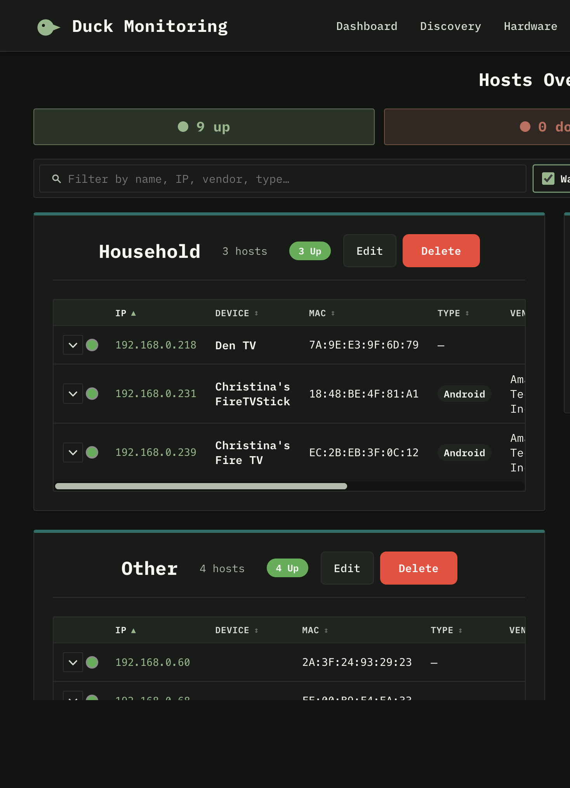
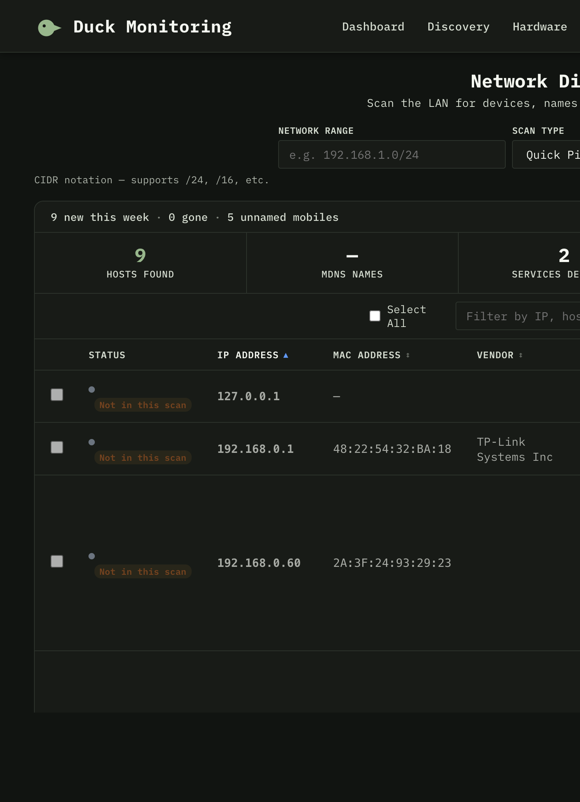
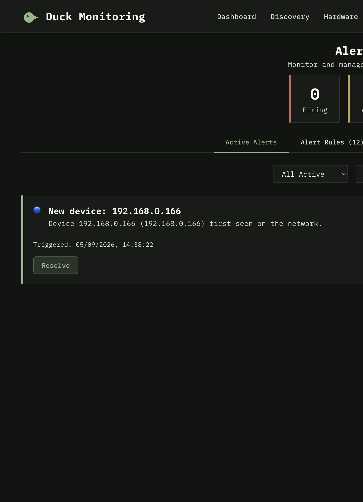
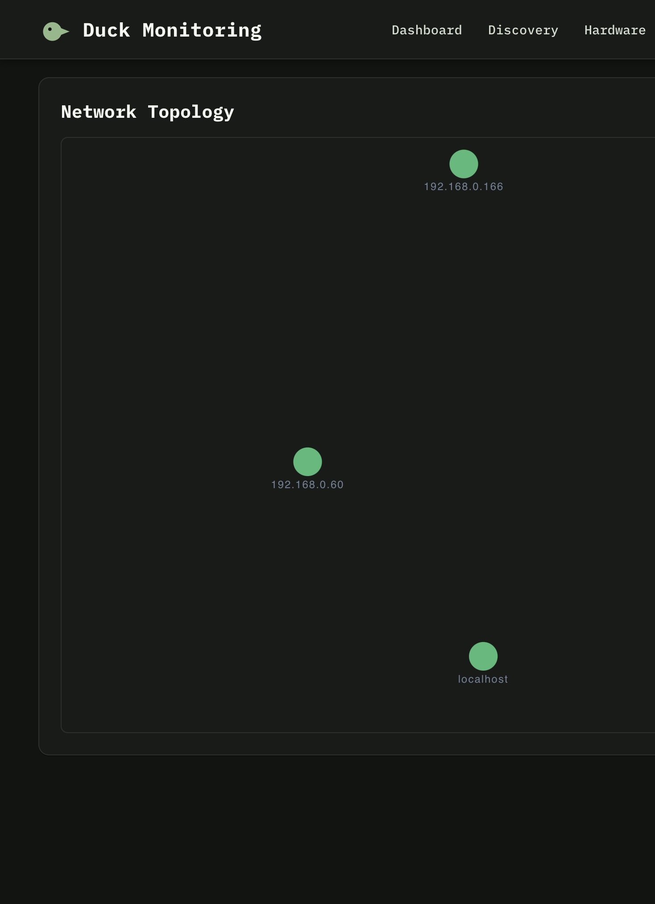

# Duck Monitoring

A personal LAN monitoring stack: see what is on the network, keep those devices as a lasting inventory, and watch reachability, agents, UPS, and SNMP hardware from one UI.

Docker Compose is the supported way to run it. The browser talks to `http://localhost:3000`; nginx proxies `/api` and `/admin` so you do not open port 8000.









## What it does

- **Hosts Overview** — lasting inventory with groups, drag-and-drop, assumed names, vendor, last seen, and open ports. Expand a row for latency, ping TTL, and watched checks.
- **Watch LAN** — keep scanning quietly and add new devices as they appear instead of treating Discovery as a one-shot import.
- **Discovery** — active subnet scan plus passive mDNS / SSDP / ARP. OS is only shown when we can actually tell (Windows, macOS, iOS, Android, Linux, and so on), not a guessed slash-union.
- **Agent checks** — optional Python agents report CPU, memory, disk, and network.
- **Agentless checks** — ping, HTTP, SSH, TCP, and similar service checks on imported hosts.
- **Hardware** — UPS and SNMP (HPE iLO, Dell iDRAC, generic OIDs).
- **Alerts** — rules and notification channels for new, gone, and down devices.
- **Topology** — a simple map of known hosts.
- **First-run setup** — create the admin user in the browser; no fixture passwords.

The UI is a muted terminal theme (IBM Plex Mono, light or dark). It is a React 19 + Vite app in front of Django 6, Postgres 18, Redis, and Celery.

## Run it

You need [Docker](https://docs.docker.com/get-docker/) with Compose V2 (`docker compose version`).

```bash
./scripts/docker-up.sh
```

That creates `.env` from `.env.example` if needed, starts Postgres, Redis, the API, Celery, and the UI, and on macOS starts a small host collector so Docker can still see ARP / MAC / names.

Open **http://localhost:3000** and create the first admin user.

```bash
./scripts/docker-up.sh --rebuild   # rebuild images after frontend or backend edits
./scripts/docker-up.sh --reset     # wipe volumes (destroys data)
./scripts/docker-down.sh           # stop, keep data
./scripts/docker-down.sh --wipe    # stop and delete volumes
docker compose logs -f
```

Health: `http://localhost:3000/api/health/`

If you reach the UI by a LAN IP instead of localhost, set `CSRF_TRUSTED_ORIGINS` in `.env` and recreate the backend container. Details: [docs/DOCKER_QUICKSTART.md](docs/DOCKER_QUICKSTART.md).

### Local / dev (no Compose)

Use this when you are editing code against a host-network stack, or you want Discovery without Docker Desktop’s multicast limits:

```bash
./scripts/start.sh            # API :8000, UI :3000, Redis, Celery
./scripts/stop.sh
./scripts/status.sh
./scripts/start.sh --reset    # wipe the local SQLite database
```

Logs land in `/tmp/duck-monitoring-backend.log`, `/tmp/duck-monitoring-frontend.log`, and `/tmp/duck-monitoring-celery.log`.

## Agents

From the UI, copy the install snippet (it points at this server). Or, against a Compose stack:

```bash
curl -sSL http://localhost:3000/api/agent/install.sh | sudo bash
```

Manual:

```bash
cd agent
python3 -m venv venv
source venv/bin/activate
pip install -r requirements.txt
python agent.py --server http://localhost:3000 --hostname my-host
```

Against a local `./scripts/start.sh` stack, use `--server http://localhost:8000` instead.

There is also a set of fake agent hosts under `docker/` for UI testing. See [docker/README.md](docker/README.md).

## Layout

```
backend_django/     Django API, inventory, discovery, alerts, Celery tasks
frontend/           React UI (Vite). Production image is nginx.
agent/              Optional host agent
scripts/
  docker-up.sh      Blessed start
  docker-down.sh    Blessed stop
  lan_identity.py   Host ARP/mDNS helper used by docker-up on macOS
  start.sh          Local/dev stack
data/lan/           Host collector output (identity.json). Not committed.
docs/               Setup, Docker, agents, architecture
```

The frontend Docker image is a production build. After UI changes, run `./scripts/docker-up.sh --rebuild` (or `docker compose up -d --build frontend`). Backend Python is also baked into the image, so rebuild the backend service after API changes.

## Docs

- [docs/DOCKER_QUICKSTART.md](docs/DOCKER_QUICKSTART.md) — Compose, `.env`, LAN caveats
- [docs/QUICKSTART.md](docs/QUICKSTART.md) — first hour
- [docs/SETUP.md](docs/SETUP.md) — local/dev setup
- [docs/AGENT_INSTALL.md](docs/AGENT_INSTALL.md) — remote agents
- [docs/ARCHITECTURE.md](docs/ARCHITECTURE.md) — how the pieces fit
- [docs/TROUBLESHOOTING.md](docs/TROUBLESHOOTING.md) — common failures
- [CONTRIBUTING.md](CONTRIBUTING.md) — branch and PR notes

## License

This project is open source and available for use.
